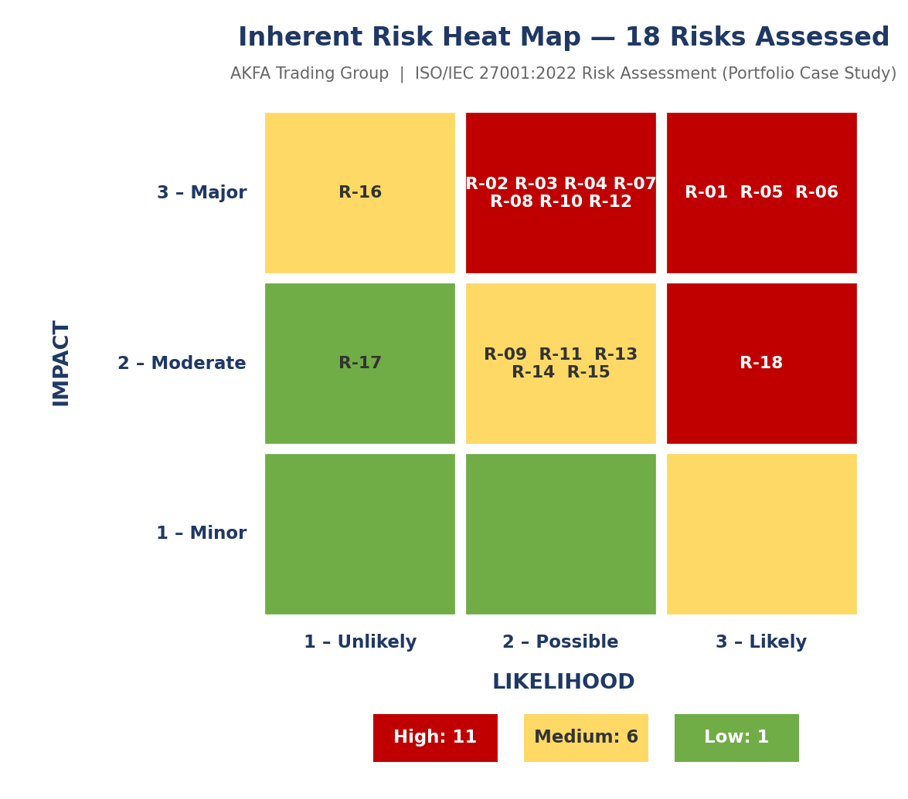
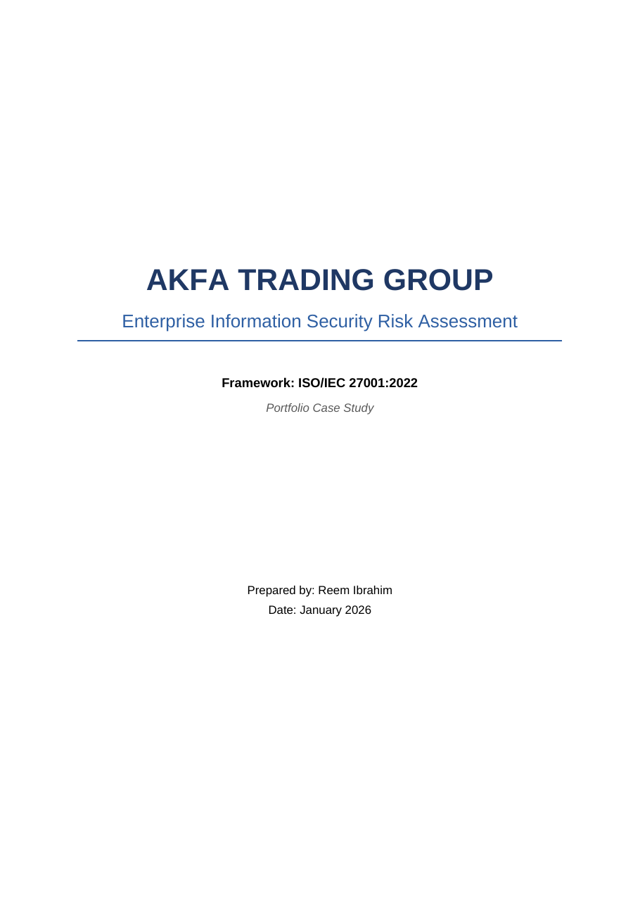
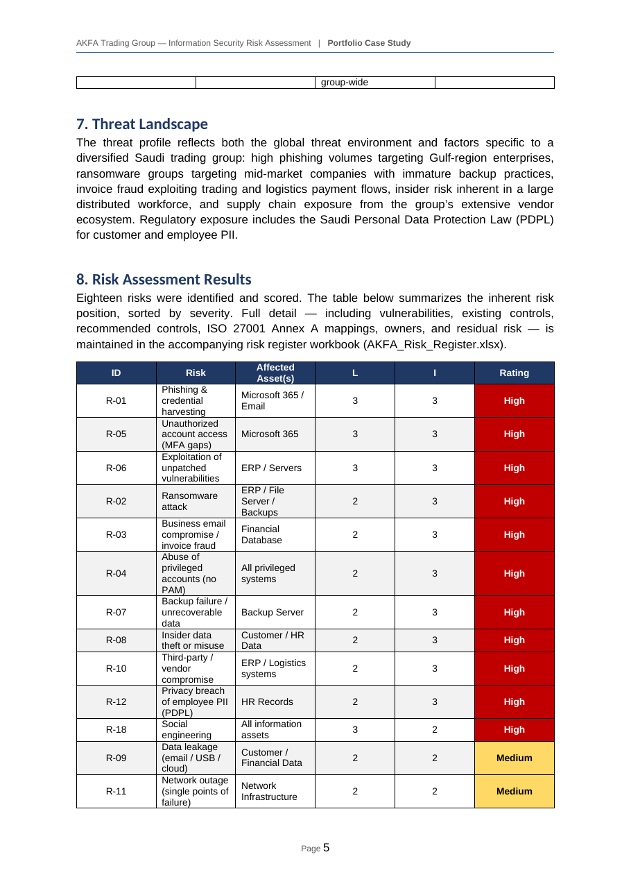
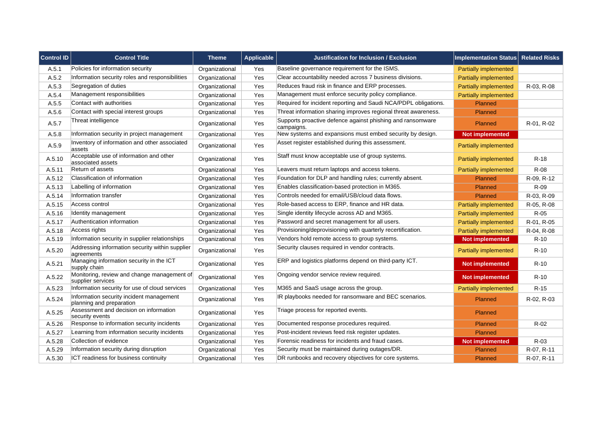
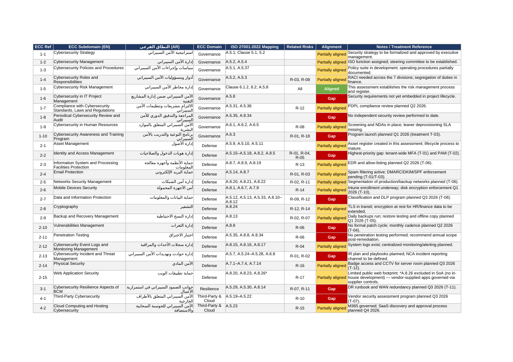

# Enterprise Information Security Risk Assessment — ISO/IEC 27001:2022

**Portfolio Case Study** | Prepared by Reem Ibrahim | January 2026

## Table of Contents

- [Business Scenario](#business-scenario)
- [Project Workflow](#project-workflow)
- [Results at a Glance](#results-at-a-glance)
- [Deliverables](#deliverables)
- [Methodology](#methodology)
- [Preview](#preview)
- [Project Structure](#project-structure)
- [Key Recommendations](#key-recommendations)
- [Frameworks & Tools](#frameworks--tools)
- [License](#license)

## Business Scenario

AKFA Trading Group is a fictional diversified Saudi enterprise (contracting, food, fisheries, healthcare, transportation, logistics, metals) used to demonstrate an end-to-end information security risk assessment aligned with **ISO/IEC 27001:2022** and the Saudi **NCA Essential Cybersecurity Controls (ECC-2:2024)**.

> ⚠️ This is a portfolio case study based on a fictional organization. No real client data is involved.

## Project Workflow

```text
        Asset Inventory (9 critical asset groups, CIA ratings)
                            │
                            ▼
        Risk Assessment (18 risks, 3×3 likelihood × impact)
                            │
                            ▼
        Risk Register + Annex A Control Mapping
                            │
              ┌─────────────┴─────────────┐
              ▼                           ▼
   Statement of Applicability     NCA ECC-2:2024 Mapping
   (93 Annex A controls)          (28 subdomains)
              │                           │
              └─────────────┬─────────────┘
                            ▼
        Risk Treatment Plan (12 prioritized actions, Q1–Q3 2026)
```

## Results at a Glance



**18 risks identified** across 9 critical asset groups: **11 High · 6 Medium · 1 Low**

## Deliverables

| File | Description |
|------|-------------|
| [Risk Assessment Report](AKFA_Risk_Assessment_Report.docx) | Full report: methodology, asset inventory, threat landscape, scored risks, key findings, and treatment plan |
| [Risk Register](AKFA_Risk_Register.xlsx) | Live Excel workbook: asset register with CIA ratings, 18 scored risks with Annex A mappings, 3×3 heat map, and treatment tracker |
| [Statement of Applicability](AKFA_Statement_of_Applicability.xlsx) | All 93 ISO 27001:2022 Annex A controls: applicability decision, justification, and implementation status |
| [NCA ECC ↔ ISO 27001 Mapping](AKFA_NCA_ECC_ISO27001_Mapping.xlsx) | All 28 NCA ECC-2:2024 subdomains mapped to ISO 27001 Annex A controls with alignment status |

## Methodology

- **Qualitative 3×3 model** — Risk Score = Likelihood (1–3) × Impact (1–3)
- **Rating bands** — High (6–9), Medium (3–4), Low (1–2)
- Every risk mapped to **ISO 27001:2022 Annex A** controls
- **Statement of Applicability** covering all 93 controls, with justified exclusions
- Residual risk estimated after recommended controls
- Regulatory context: **Saudi PDPL** and **NCA ECC-2:2024** (mapped across all 28 subdomains)

## Preview

| Report | Risk Assessment Results |
|--------|------------------------|
|  |  |

| Statement of Applicability | NCA ECC Mapping |
|---------------------------|-----------------|
|  |  |

## Project Structure

```text
├── AKFA_Risk_Assessment_Report.docx      # Main assessment report
├── AKFA_Risk_Register.xlsx               # Risk register + heat map + treatment tracker
├── AKFA_Statement_of_Applicability.xlsx  # 93 Annex A controls (SoA)
├── AKFA_NCA_ECC_ISO27001_Mapping.xlsx    # NCA ECC-2:2024 ↔ ISO 27001 matrix
├── report-cover.png                      # Preview images
├── risk-table.png
├── soa-preview.png
├── ecc-mapping-preview.png
├── LinkedIn_2_Heat_Map.png
└── README.md
```

## Key Recommendations

Enforce tenant-wide MFA, deploy PAM, run quarterly phishing simulations, formalize patch management, test backup restores quarterly (3-2-1 strategy), and establish a vendor security assessment program.

**Key takeaway:** the highest-impact improvements weren't expensive tools — enforcing MFA, testing backup restores, and establishing patch discipline reduce more risk than any single platform investment.

## Frameworks & Tools

- ISO/IEC 27001:2022 (ISMS requirements, Annex A)
- ISO/IEC 27005 (risk management guidance)
- NCA Essential Cybersecurity Controls (ECC-2:2024)
- Saudi Personal Data Protection Law (PDPL)
- Microsoft Excel (risk register, SoA, mapping matrices)
- Microsoft Word (assessment report)

## License

For portfolio and educational purposes only.

---

**Skills demonstrated:** Risk Assessment · ISO 27001:2022 · Statement of Applicability · NCA ECC-2:2024 · GRC · Risk Treatment Planning · Annex A Controls Mapping
